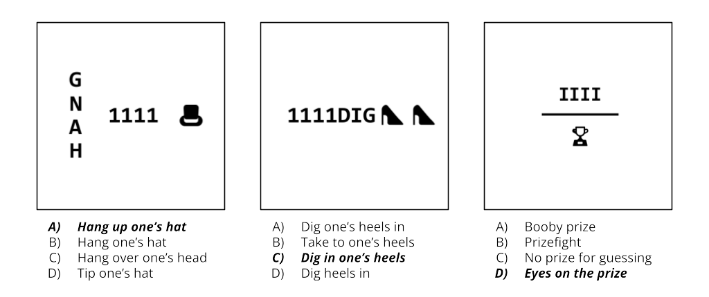

<div align="center">
<h1>COLUMBUS: Evaluating <ins>CO</ins>gnitive <ins>L</ins>ateral <ins>U</ins>nderstanding through <ins>M</ins>ultiple-choice re<ins>BUS</ins>es</h1>

Inspired by the demonstration of lateral thinking in the story of *Columbus' Egg*, this repository presents a benchmark of multiple-choice rebus puzzles. These are designed to challenge the creative problem-solving skills of visual question answering (VQA) models. 

[**🤗 Dataset**](https://huggingface.co/datasets/koen-47/COLUMBUS) | [**📓 Notebooks**](./notebooks) | [**🌐 Website**](https://columbus-vqa.github.io/)

<picture>
    <source media="(prefers-color-scheme: dark)" srcset="./visualizations/columbus_puzzle_examples_dark.png">
    
</picture>

[//]: # (![COLUMBUS puzzles examples_white]&#40;./visualizations/columbus_puzzle_examples_dark.png&#41;)

</div>

[//]: # (## Notebooks)

[//]: # ()
[//]: # (There are three [notebooks]&#40;./notebooks&#41; that provide a more streamlined experience interacting with COLUMBUS. Alternatively, for a more in-depth and hands-on experience, see the *Installation* section below.)

## Installation

Create a conda environment with a name of your choice with Python version 3.12:


```python
conda create -n <env_name> python=3.12
```

Activate it and install all necessary libraries:

```python
pip install -r requirements.txt
```

### Displaying the benchmark

To display the benchmark, run the following command. This will loop over the benchmark and present each puzzle and its respective distractors. 

```python
python main.py --show-benchmark
```

### Displaying the results

Running either of the following commands to display the results for the puzzle and model analysis, respectively. This will display the tables from the thesis.

```python
python main.py --show-analysis puzzles
```

```python
python main.py --show-analysis models
```

### Evaluating the benchmark

Run the following command to run a specified model with a specified prompt on the benchmark. This is only applicable to the open-source models.

```
cd cluster
```


```python
python main.py [model] [prompt]
```

The model arguments are either: `blip2-opt-2.7b`, `blip2-opt-6.7b`, `blip2-flan-t5`, `instruct-blip`, `fuyu`, `llava-1.5-13b`, `llava-1.6-34b`, `clip`, `cogvlm`, `qwenvl`, or `mistral`.

The prompt arguments either: `1`, `2`, `3`, or `4`

Running `mistral` with prompts `1` or `2` will throw an error. Prompts for `clip` are ignored. See `cluster/main.py` for a clear overview of the arguments and their constraints. Make sure you have the correct API token for Mistral set to the label `MISTRAL_API_KEY`.


## Data Selection and Collection

The following files consist of the raw data scraped, downloaded or manually collected (custom) to be used as input for our puzzle generation pipeline (see Section 4):
- Compound words: [source](https://era.library.ualberta.ca/items/dc3b9033-14d0-48d7-b6fa-6398a30e61e4) + [custom](./data/input/custom_compounds.csv) 
- Idioms/phrases: [source](./data/input/idioms_raw.json) + [custom](./data/input/custom_phrases.json)
- Icons: [source](./data/misc/icons_v2.json)
- Homophones: [source](./data/misc/homophones_v2.json)


##  Puzzle Generation

All files relating to puzzle generation can be found under [puzzles](./puzzles). The main ones are as follows:
- [Rule definition](./puzzles/patterns/Rule.py): defines the rule taxonomy and a function to search for rules given a word (see Section 3.1).
- [Compound graph parser](./puzzles/parsers/CompoundRebusGraphParser.py): parses a compound word into its graph representation (see Section 3.2).
- [Phrase graph parser](./puzzles/parsers/PhraseRebusGraphParser.py): parses an idiom/phrase into its graph representation (see Section 3.2). 
- [Image generation](./puzzles/RebusImageConverter.py): generates a rebus puzzle from its graph representation (see Section 3.2).
- [Distractor generation](./scripts/generate_distractors.py): generates three distractors for each question given the correct answer (see Section 3.3).

## Results

All files used to prompt the models in our experiments can be found under the [cluster](./cluster) folder. This is a duplicated, smaller version of this repository to use on a local cluster. The file used to prompt each model is as follows:

- [CLIP](cluster/models/CLIPExperiment.py)
- [BLIP-2](cluster/models/BLIP2Experiment.py) (OPT 2.7b, OPT 6.7b, Flan-T5-XXL-11b)
- [InstructBLIP](cluster/models/InstructBLIPExperiment.py)
- [Fuyu](cluster/models/FuyuExperiment.py)
- [QwenVL](cluster/models/QwenVLModel.py)
- [CogVLM](cluster/models/CogVLMModel.py)
- [Llava](cluster/models/LlavaExperiment.py) (1.5-13b, 1.6-34b)
- [Mistral](cluster/models/MistralExperiment.py)
- [Closed-source](cluster/models/close_sourced.ipynb) (also includes forward chaining)
- [Backward chaining](./scripts/run_belief_graphs.py)

A few files also analyze [model performance](./results/analysis/AnalysisReport.py) and the [benchmark](./results/benchmark/PuzzleAnalysisReport.py). For additional analysis pertaining to computed averages (in Section 6), run the following command:
```python
python scripts/analyze_results.py
```